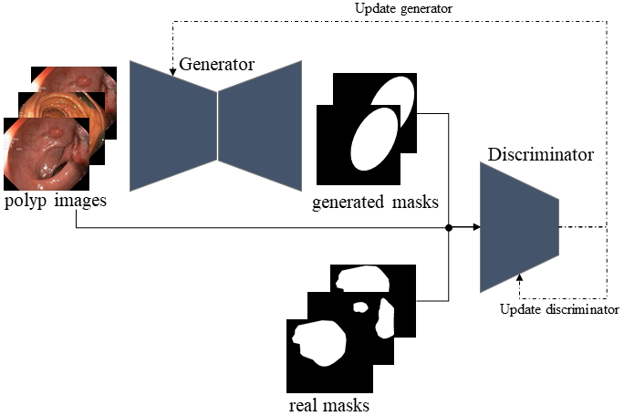

# GANPolypSeg

## Abstract
This work aims to contribute in bench-marking the automatic polyp segmentation problem using generative adversarial networks framework. Perceiving the problem as an image-to-image translation task, conditional generative adversarial networks are utilized to generate masks conditioned by the images as inputs. Both generator and discriminator are convolution neural networks based. The model achieved 0.4382 on Jaccard index and 0.611 as F2 score. 

## Reference Paper:
https://arxiv.org/abs/2012.06771

## Presentaion Video:
https://www.awadelrahman.com/blog/2021-06-02-My-Talk-in-%26nbsp%3BMedico-challenge%3A%26nbsp%3BGenerative-Adversarial-Networks-for-Automatic-Polyp-Segmentation%26nbsp%3B.html?post_id=14

## GAN-based Model

## Result on test set

